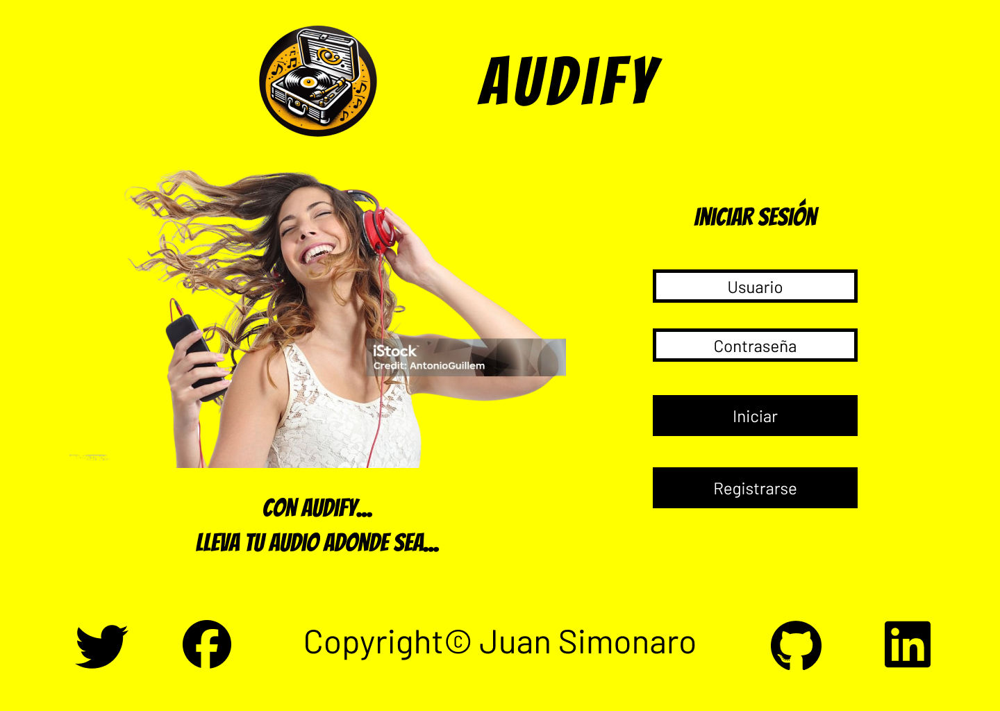
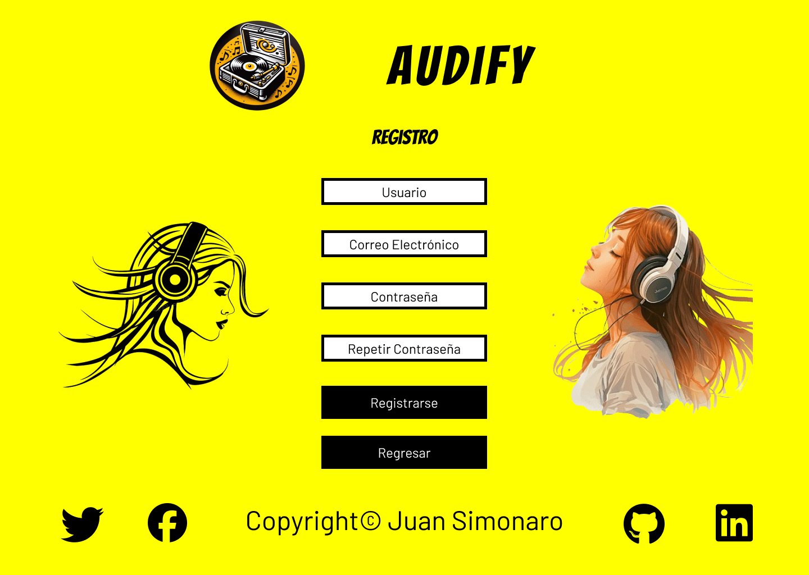
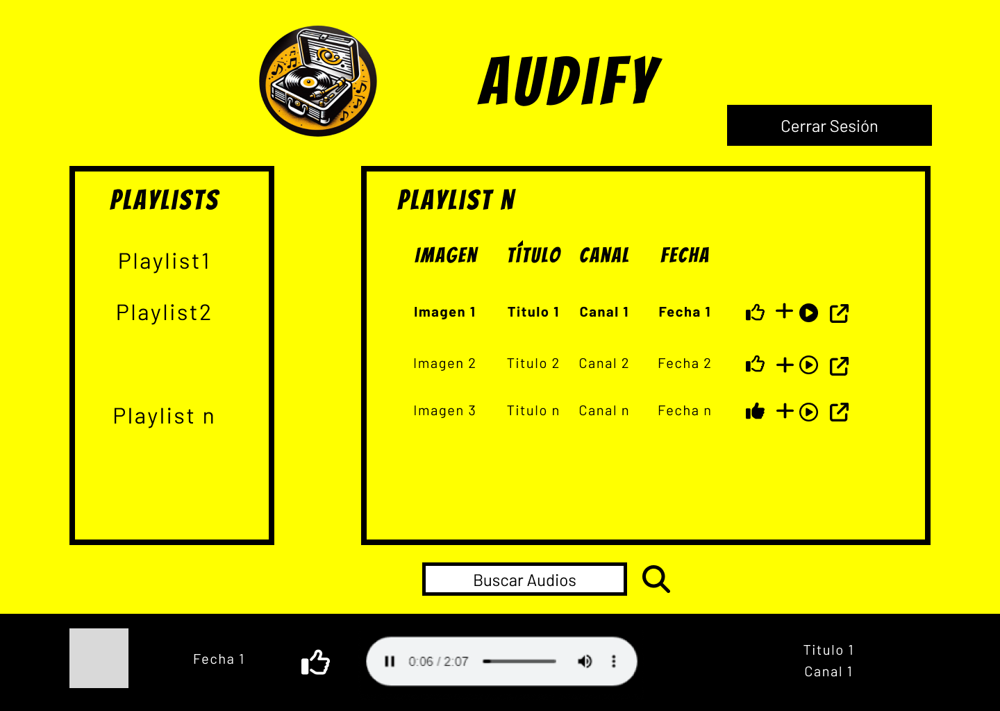
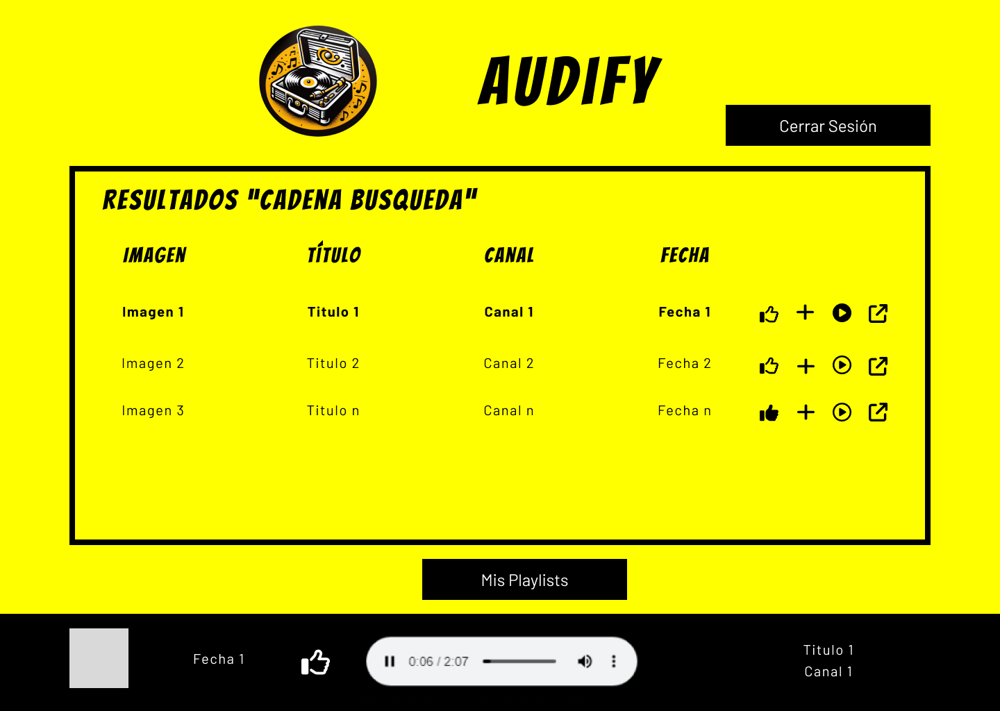

Este proyecto Audify se hizo con sólamente código html, css y javascript; una vez realizado su diseño mediante [Figma](https://figma.com). La función de este proyecto Audify es la de obtener los videos de youtube para poder obtener solo su audio y reproducirlo de forma instantánea. Además de implementar una gestión de usuario para que los usuarios puedan crear sus playlists con los videos encontrados en la búsqueda de Youtube. Para poder hacerlo se hizo uso de __localStorage__ para poder almacenar los datos que el usuario va generando, de la __API de Youtube__ para poder buscar los videos y obtener los identificadores de videos para que los usuario puedan guardar sus playlists, de la librería __CryptoJS__ para poder codificar la contraseña del usuario y de un __obtenedor de enlaces__ para poder obtener un enlace de audio del sitio [yt2html](https://yt2html5.com/), el cual al pasarle el parámetro id con el identificador se obtienen los enlaces directos a los videos en diferentes formatos entre ellos el de audio.

## Instrucciones de uso

### Primera Página - Inicio de sesión 

En esta página se encuentra el _login_ o _inicio de sesión_ al ser la primera vez que se usa no existen registros de usuarios por lo que obligatoriamente hay que [registrar un usuario](#segunda-pagina---registro-de-usuarios).

Cabe destacar de esta página tiene una animación css con 3 mujeres con audífonos apareciendo y desapareciendo a intervalos de 6 segundos. Para poder _iniciar sesión_ se codifica la contraseña y con esa contraseña se compara con la almacenada en localStorage. Si coinciden entonces se accede a la [tercera página](#tercera-pagina).

### Segunda Página - Registro de usuarios

Aquí se encuentra el _registro de usuarios_ en donde una vez ingresado los campos y haber hecho click en _Registrarse_ se registra el _nombre de usuario_, el _correo electrónico_ y la _contraseña_ dentro de localStorage, así como una lista de _playlists_ en el que solo tendrá inicialmente el playlist _MeGusta_. Al registrarse automáticamente queda iniciada la sesión y se redirige a la [tercera página o playlists](#tercera-página---playlists). Además está el botón de _Regresar_ el cual regresa a la [primera páginal o inicio de sesión](#primera-página---inicio-de-sesión).

### Tercera Página - Playlists

En esta página los usuarios podran crear susu playlists y ver lo que han guardado dentro de esos playlists. La primera vez solamente se verá el playlist de _MeGusta_ el cual estará vacío porque todavía no se ha agregado ningún audio. Para poder realizar una busqueda de audios sólo se tendrá que escribir los que se quiere buscar dentro dentro del campo _Buscar Audios_ y luego hacer click en la imagen de la _lupa_. Este Enlace redireccionará a la [cuarta página o busqueda de audios](#cuarta-página---búsqueda-de-audios).
También nos muestra por primera en la parte inferior de la pantalla el reproductor de audio html5 fija al final de la pantalla

### Cuarta Página - Búsqueda de audios

Aquí aparecerán los resultados de la busqueda de audios solicitada en la [tercera página o playlists](#tercera-página---playlists). Internamente lo que se hará es realizar una búsqueda a la __API de Youtube__ la cadena de texto que se desea buscar. Una vez que se realizó la busqueda de forma asíncrona se listarán los resultados dentro de la tabla.
También nos muestra por primera en la parte inferior de la pantalla el reproductor de audio html5 fija al final de la pantalla. 
Además tiene un botón de Cerrar Sesión el cual redirige a la [primera página](#primera-página---inicio-de-sesión).

### Botones de gestion de audio

#### Pulgar arriba

Este botón se usa para agregar el audio a la playlist de MeGusta. Además de cambiar a un diseño rellenado indicando que ese audio le ha gustado.

#### Agregar a Playlist

Al hacer click en este boton se abre un menu contextual el cual muestra los playlists ya creados por el usuario al hacer click en uno de estos playlists quedará guardado el audio dentro del playlist.

#### Play

Este boton se usa para indicarle al reproductor de audio que audio debe reproducir, además de mostrar información en la parte inferior acerca de audio que se está reproduciendo.

#### Fuente video

Reedirige al enlace original del video de Youtube.

[Enlace Figma](https://www.figma.com/file/FVvFDZ1ufKW862xJYlrGmk/Untitled?type=design&node-id=25%3A71&mode=design&t=LBjYXNYN6s93QIrN-1)